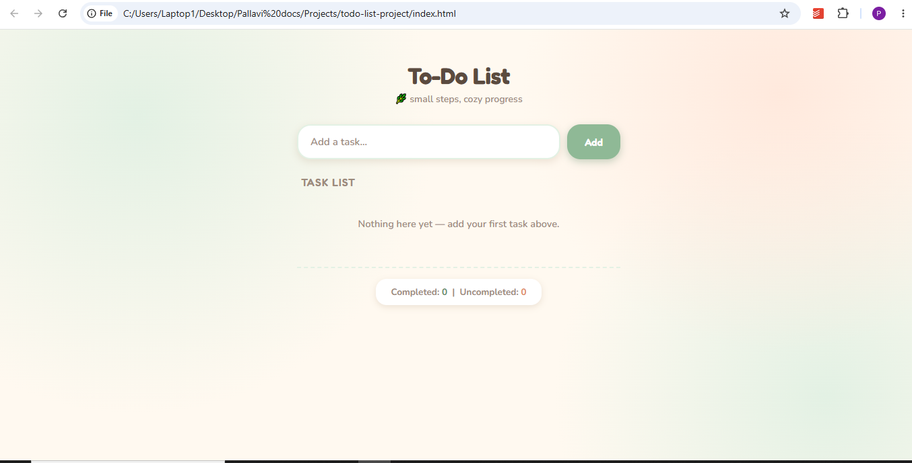
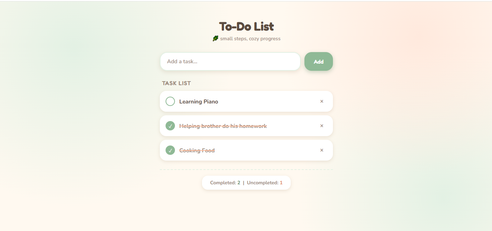

# 📝 To-Do List Web Application

A clean and responsive To-Do List built using HTML, CSS, and JavaScript. Users can add, complete, and delete tasks while tracking completed and pending items.

## Features

- Add new tasks
- Mark tasks as completed
- Delete tasks
- Live task counter
- Responsive design
- Minimal modern UI

## Technologies Used

- HTML5
- CSS3
- JavaScript (ES6)

## Project Structure

```
todo-list-project/
│── index.html
│── style.css
│── script.js
│── README.md
│── assets/
    ├── screenshot1.png
    └── screenshot2.png
```

## Screenshots

### Empty State



### Tasks Added



## Future Improvements

- Local Storage
- Dark Mode
- Task Categories
- Due Dates
- Search Tasks

## Author

Pallavi Chavan
